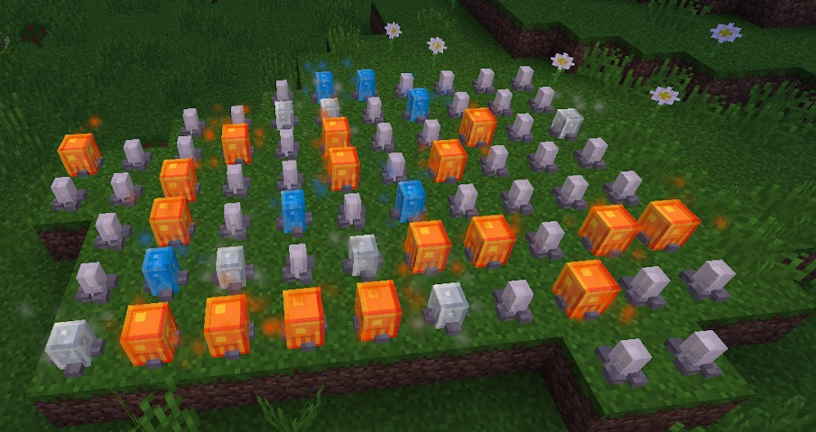

These gems are grown in the same matter that Crystals are grown except instead of using Stardust as the catalyst you will need to use Glowstone. These clusters will sparkle when they are ready for harvesting (with a pickaxe), harvesting these too early will net you nothing.

These crystals grow in the same manner as Celestial crystals but these gems are used in the perk tree:

The stats on these gems is random and there are 3 different kinds:

* Ilium Gems
* Fengarum Gem
* Ourium Gem

Growing these crystals takes time and the gem outcome is related to the time that the final stage of the gem is formed at, these gems are no different from each other, the stats are always random.

* Fengarums will trigger between 14743-21257
* Iliums will trigger between 23658-12342
* Ourium will trigger between 12343-14742 and 21258-23657

It would be advisable to plant these gems as quickly and as early as possible because growing them takes time and is mostly about luck. If you don't like the outcome of them gem it's possible to wait. After some time it will convert back into the previous stage which will allow it to grow into a new Dynasty gem, depending on the time. This is useful if you don't have spare rock crystals to grow a new gem.
